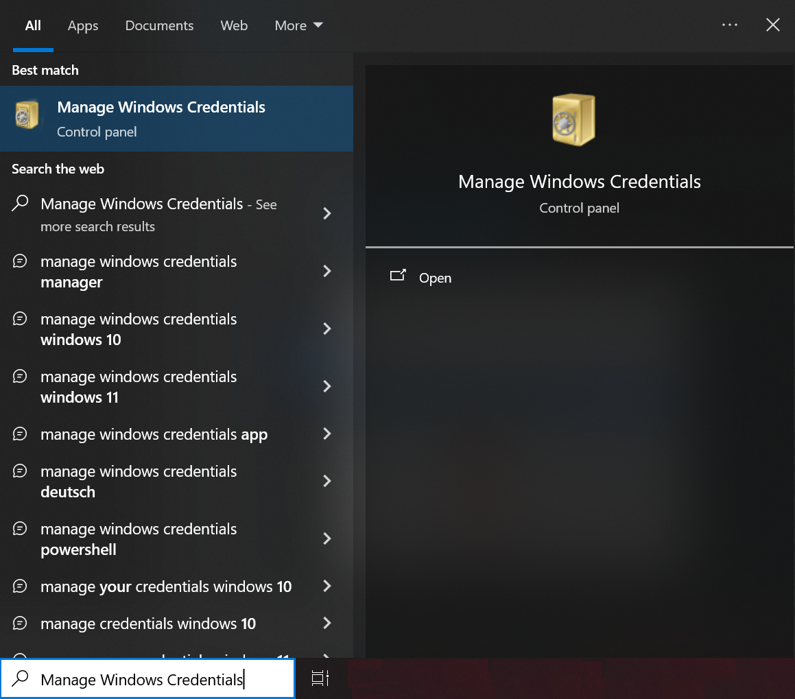
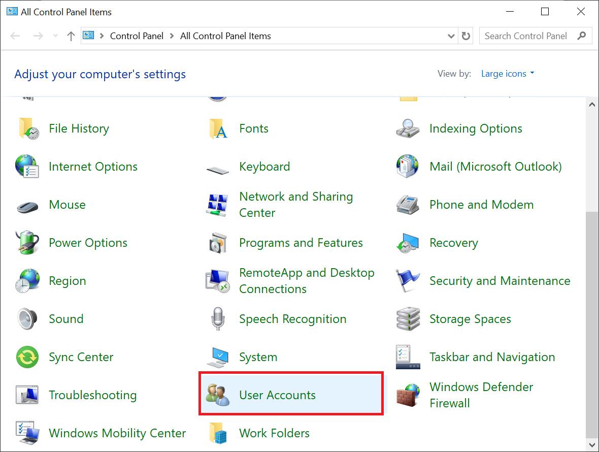
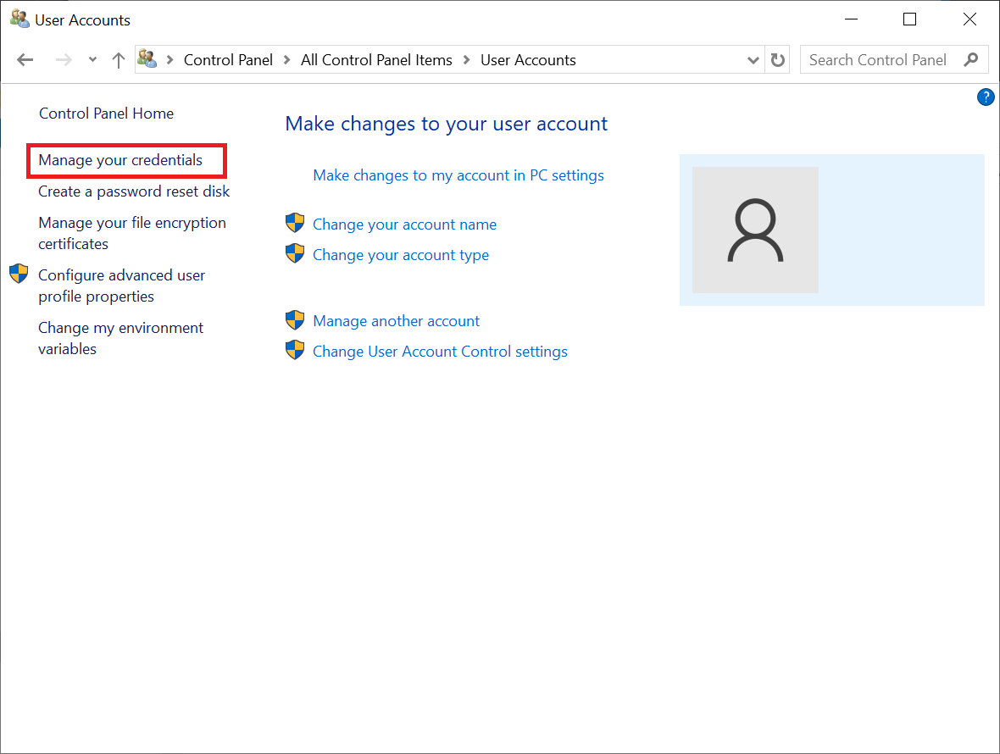
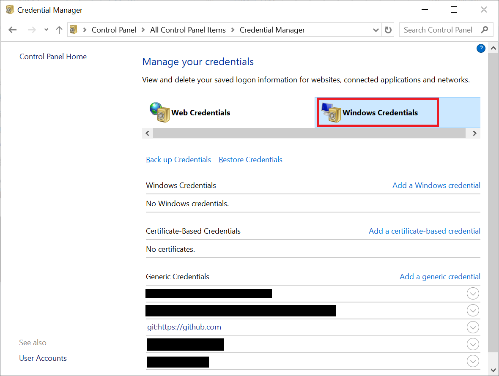
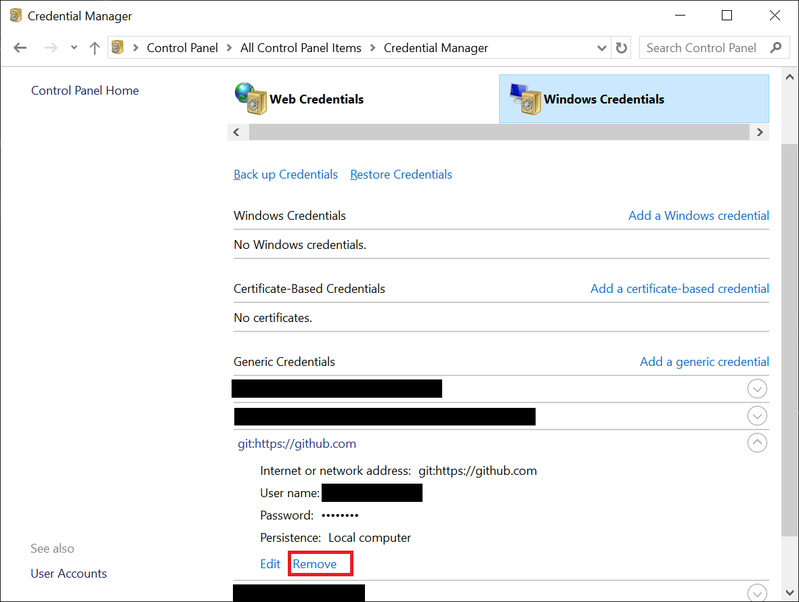
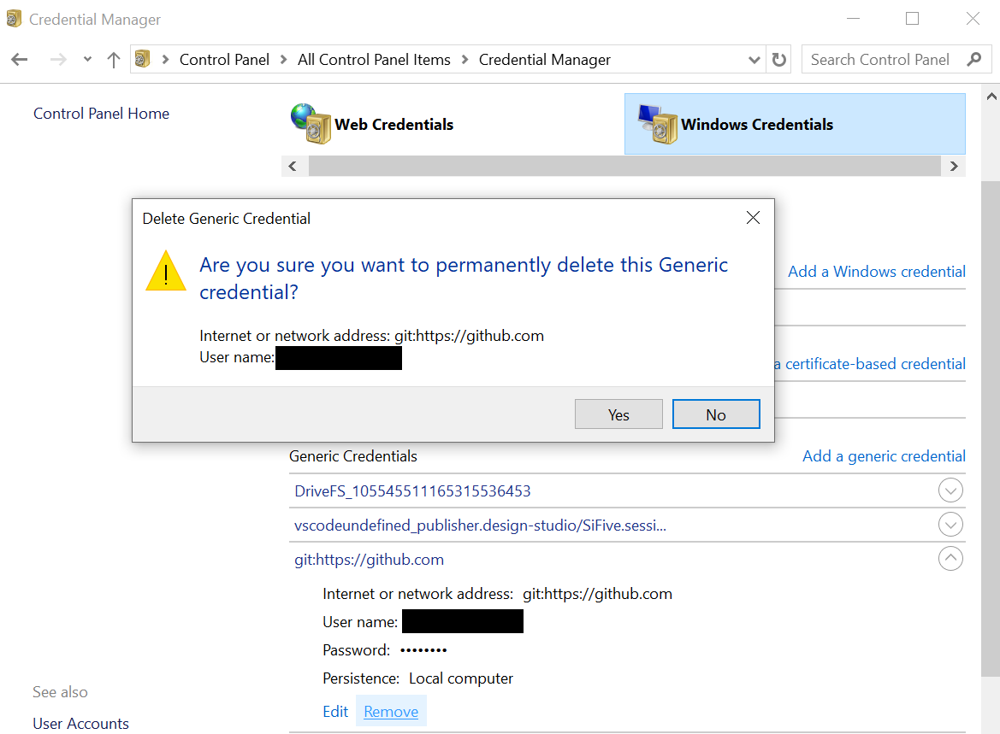

# 如何切換 GitHub 帳號

## SSH

## HTTPS

### Windows

從 `Windows 認證管理員` 將 Git 的資訊移除

1. 開啟 Windows Credentials (下列方法擇一即可)

    - 直接搜尋 `Manage Windows Credentials`
    
    
    
    - Control Panel –> User Accounts –> Manage Windows Credentials
    
    
    
    
    
    

2. 移除 Git 的認證

